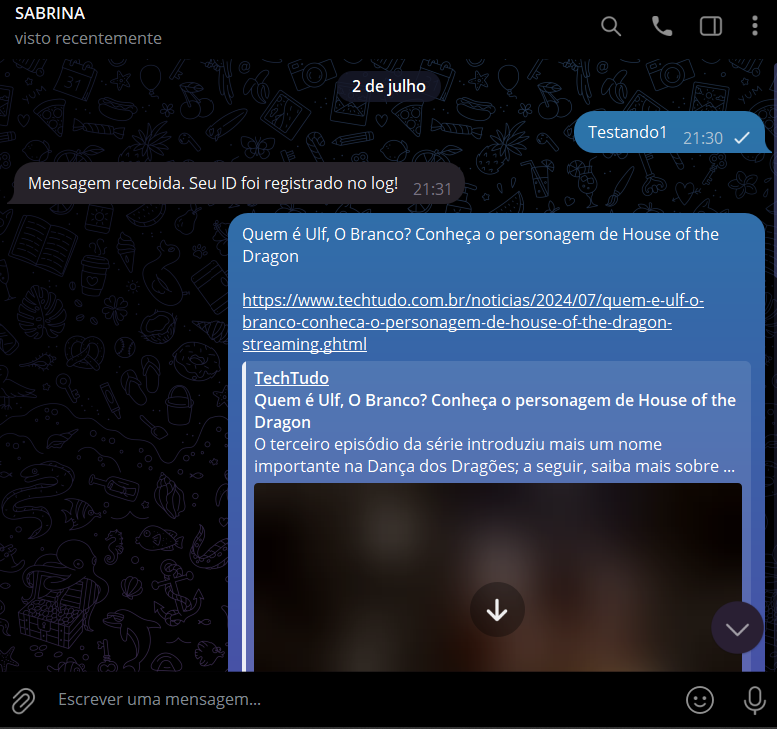
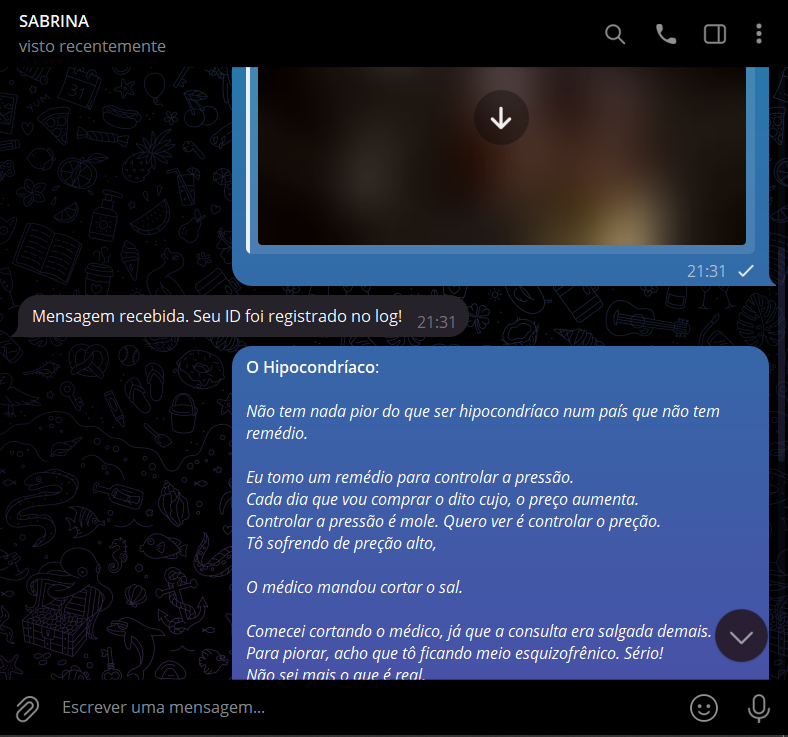
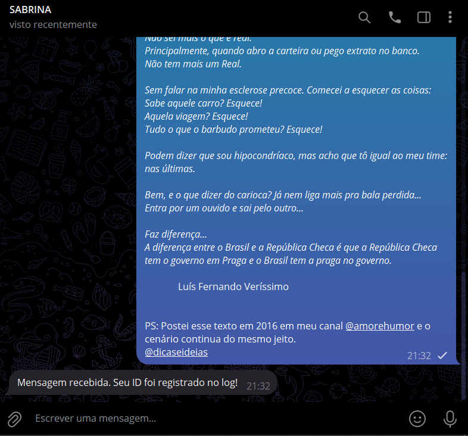
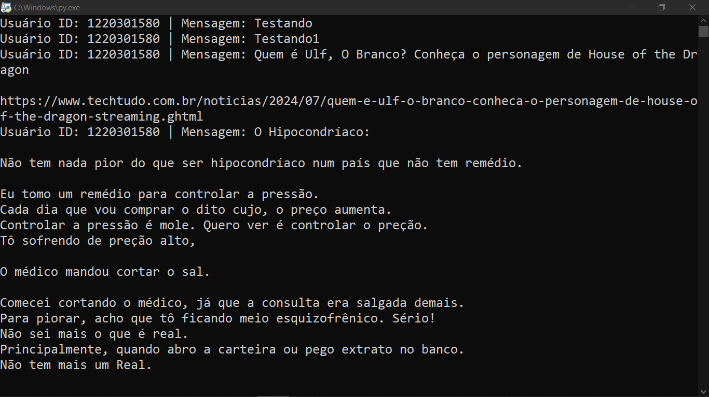
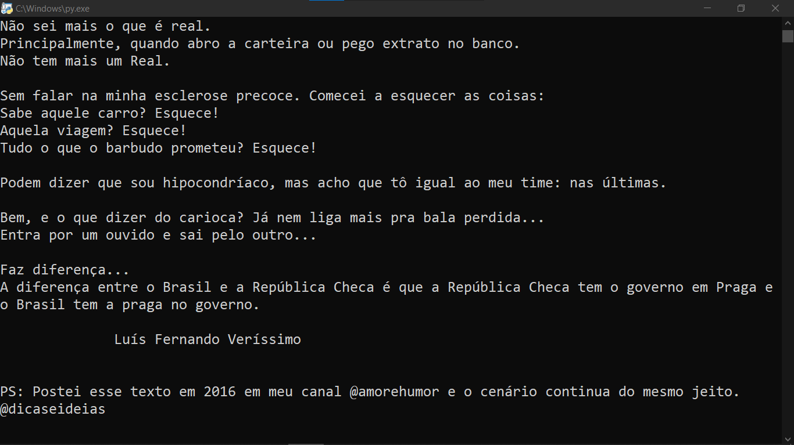

# LOGID COM PYROGRAM
🤤ESSE É UM BOT DO TELEGRAM FEITO COM PYROGRAM. É ÚTIL PARA ADMINISTRADORES QUE DESEJAM MONITORAR AS INTERAÇÕES DOS USUÁRIOS, UTILIZANDO A SAÍDA DO CONSOLE PARA VISUALIZAR AS MENSAGENS!

 <br>
 <br>
 <br>
 <br>
 <br>

## DESCRIÇÃO:
Este bot de log foi desenvolvido usando Pyrogram para Telegram. Ele registra no console do servidor o ID do usuário e a mensagem que o usuário envia para o bot. É útil para monitorar interações dos usuários e registrar informações relevantes para análise ou acompanhamento.

## FUNCIONALIDADES:
- **Registro de Mensagens**: Registra no console do servidor o ID do usuário e o conteúdo da mensagem enviada pelo usuário para o bot.
- **Monitoramento Simples**: Facilita o acompanhamento das interações dos usuários com o bot no Telegram.
- **Resposta de Confirmação**: Responde automaticamente ao usuário com uma mensagem de confirmação sempre que uma mensagem é recebida e registrada.

## EXECUTANDO O PROJETO:
1. **Autorização do usuário:**
   - Para usar a API, o Telegram requer que os usuários sejam autorizados por meio de seus números de telefone. Para fazer isso, siga as instruções do Telegram em [https://core.telegram.org/api/obtaining_api_id](https://core.telegram.org/api/obtaining_api_id). A chave da API consiste em duas partes: `api_id` e `api_hash`. Mantenha-a secreta. [SAIBA MAIS.](https://docs.pyrogram.org/start/setup)

   - Após a autorização bem-sucedida, um novo arquivo chamado `my_account.session` será criado, permitindo que o Pyrogram execute chamadas de API com sua identidade. Este arquivo é pessoal e será recarregado automaticamente quando você reiniciar seu aplicativo. O `my_account.session` funciona como o token do seu bot. Depois de gerado, coloque-o dentro do diretório `CODIGO`. [SAIBA MAIS.](https://docs.pyrogram.org/start/auth)

2. **Instalando as dependências:**
   - Antes de executar o bot, certifique-se de instalar todas as dependências necessárias. No terminal, execute o seguinte comando para instalar as dependências listadas no arquivo `requirements.txt` em `CODIGO`:
   ```bash
   pip install -r requirements.txt
   ```

3. **Inicie o Bot:**
   - Execute o bot do Telegram iniciando-o com o seguinte comando:
    ```bash
    python CODIGO.py
    ```

4. **Interagindo com o Bot**:
   - Envie mensagens privadas para o bot no Telegram.
   - Cada mensagem enviada será registrada no console do servidor junto com o ID do usuário que a enviou.
   - O bot responderá automaticamente com uma mensagem de confirmação de que a mensagem foi recebida e registrada.

## NÃO SABE?
- Entendemos que para manipular arquivos em muitas linguagens e tecnologias relacionadas, é necessário possuir conhecimento nessas áreas. Para auxiliar nesse aprendizado, oferecemos cursos gratuitos disponíveis:
* [CURSO DE PYROGRAM](https://github.com/VILHALVA/CURSO-DE-PYROGRAM)
* [CURSO DE PYTHON](https://github.com/VILHALVA/CURSO-DE-PYTHON)
* [CONFIRA MAIS CURSOS](https://github.com/VILHALVA?tab=repositories&q=+topic:CURSO)

## CREDITOS:
- [PROJETO CRIADO PELO VILHALVA](https://github.com/VILHALVA)

